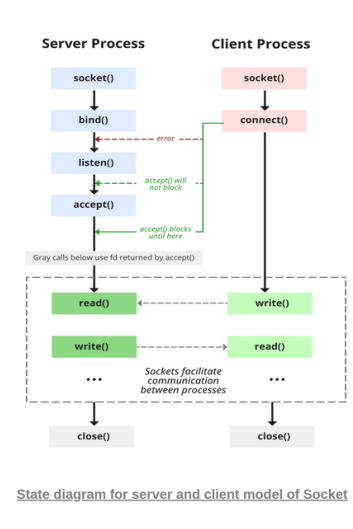

# Guía De Aprendizaje - Sockets en Java (TCP y UDP)

## Comunicación en red.
- **¿Qué es?:** es el intercambio de información entre **dos programas.** Para crear una conexión es necesario una dirección y un puerto.

## Socket.
- **Qué es un socket:** es un canal de comunicación entre dos programas. Usados, normalmente, para implementar **el modelo cliente-servidor.**

## Modelo cliente-servidor.
- **¿Qué es?:** es una arquitectura en la que el **cliente** usa unos **servicios** y el **servidor** es el encargado de proporcionarlos.
- **Funciones de cada uno:**
    - **Servidor:** se ejecuta primero, abre un puerto, espera conexiones y atiende peticiones.
    - **Cliente:** se ejecuta después, sabe la dirección y el puerto, inicia la comunicación/conexión, envía datos y recibe respuesta.

### Diagrama de servidor y cliente con socket


### TCP y UDP. Tipos de sockets.
#### ¿Qué es TCP?
Es un protocolo orientado a conexión, fiable y orden garantizado. Es usado cuando los datos son importantes y no se pueden perder mensajes.

- **Sockets TCP:**
    - Orientados a conexiones, **comunicación fiable**, **datos llegan en orden y sin perdidas**, se establece una **conexión previa (handshake)**.
    - **Usos:** Chats, servidores de apps, transferencias de datos.

- **Clases de Java (del paquete java.net) :**
    - **ServerSocket:** usada para abrir un puerto y escuchar conexiones.
        - Algunos Métodos:
            **accept():** usado para esperar un cliente.
            **close():** cierra el servidor.
    - **Socket:** usada para el cliente conectarse y para comunicarse con el cliente.
        - Algunos Métodos:
            **getInputStream():** usado para obtener la entrada del servidor y enviarle datos.
            **getOutputStream():** usado para obtener la salida estandar del servidor y enviarle datos.
            **close():** cierra la conexión.
        **Siempre se deben cerrar los streams antes que el socket.**

- **Desarrollo modelo cliente - servidor TCP:**
    - **ServidorTCP.java:** encargada de abrir un puerto, esperar un cliente, recibir un mensaje, responderlo y cerrar la conexión.
    ```java
    import java.net.*;
    import java.io.*;
    public class ServidorTCP {
        public static void main(String[] args) {
            try {
                // Abrimos el puerto 5000
                ServerSocket servidor = new ServerSocket(5000);
                System.out.println("Servidor TCP esperando conexiones...");
                // Se espera una conexión
                Socket cliente = servidor.accept();
                System.out.println("Cliente conectado");
                // Preparamos entrada y salida
                BufferedReader entrada = new BufferedReader(new InputStreamReader(cliente.getInputStream()));
                PrintWriter salida = new PrintWriter();
                // Leemos el mensaje del cliente
                String mensaje = entrada.readLine();
                System.out.println("Cliente dice: " + mensaje);
                // Respondemos al cliente
                salida.println("Servidor recibe: " + mensaje);
                // Cerramos conexión
                cliente.close();
                servidor.close();
                } catch (IOException e) {
                    e.printStackTrace();
                }
        }
    }
    ```

    - **ClienteTCP.java (soporte 1 cliente):** se conecta al servidor, envia un mensaje, espera la respuesta, cierra.
    ```java
    import java.net.*;
    import java.io.*;
    public class ClienteTCP {
        public static void main(String[] args) {
            try {
            // Conexión al servidor
            Socket socket = new Socket("localhost", 5000);
            BufferedReader entrada = new BufferedReader(new InputStreamReader(socket.getInputStream()));
            PrintWriter salida = new PrintWriter(socket.getOutputStream(), true);
            // Enviamos mensaje
            salida.println("Hola servidor");
            // Recibimos respuesta
            String respuesta = entrada.readLine();
            System.out.println("Servidor responde: " + respuesta);
            socket.close();
            } catch (IOException e) {
            e.printStackTrace();
            }
        }
    }

    ```

    -  **Uso de hilos para manejar varias peticiones/conexiones:**
    ```java
        // Se define un bucle infinito, dentro del servidor, para estar siempre manejando peticiones...
        while(true){
            // Al recibir una petición, la almacenamos en un objeto de la clase 'Socket'.
            Socket cliente = servidor.accept();
            // Instanciamos un objeto de la clase "AtencionCliente()" la cual implementa la interfaz 'Runnable' y nos permitirá manejar esa comunicación de manera independiente.
            new Thread(new AtencionCliente(cliente)).start();
        }
    ```

#### ¿Qué es UDP?
Es un protocolo sin conexión, rápido, no es fiable y no garantiza el orden
- **Sockets UDP:**
    - No orientados a conexión, no se garantiza orden ni recepción, no hay conexión previa.
    - **Usos:** Streaming, juegos online, DNS...

- **Clases de Java:**
    - **DatagramSocket():** es el punto desde el que se envian o reciben mensajes UDP.
    **Constructores:**
        - DatagramSocket()
        - DatagramSocket(int puerto)
    **Métodos:**
        - send(DatagramPacket)
        - receive(DatagramPacket)
        - close()
    - **DatagramPacket():** es un mensaje **UDP**, el cual tiene:
        datos
        longitud
        ip
        puerto

#### Desarrollo de Modelo Cliente - Servidor UDP
**ServidorUDP.java:** Funciones: abrir puerto, esperar mensajes, responder al remitente y seguir esperando.
```java
import java.net.*;
public class ServidorUDP{

    public static void main(Strings[] args){
        try{

            // Definimos desde que puerto vamos a recibir nuestros paquetes
            DatagramSocket dtgSocket = new DatagramSocket(6000);
            System.out.println("Servidor UDP iniciado y a la escucha en el puerto 6000");
            while(true){
                // creamos un array de byte para almacenar el contenido del mensaje.
                byte[] buffer = new byte[1024];

                // creamos un objeto 'DatagramPacket' para recibir el contenido de la petición y almacenarlo en el arreglo de byte
                DatagramPacket paquete = new DatagramPacket(buffer, buffer.length);

                // se espera hasta que se reciba un paquete, cuando se reciba el contenido del paquete se guardará en 'buffer'
                dtgSocket.receive(paquete);
                System.out.println("El servidor ha recibido un mensaje...");

                // Almacenamos el contenido del buffer en un String
                String mensaje = new String(paquete.getData(), 0, paquete.getLength());
                // Imprimimos el contenido del mensaje
                System.out.println("Mensaje recibido:"+mensaje);

                // Definimos un mensaje para devolver como respuesta
                String respuesta = "Servidor UDP recibe: "+mensaje;
                
                // Obtenemos los bytes de la respuesta (Importante)
                byte[] datosRespuesta = respuesta.getBytes();

                // Creamos un objeto 'DatagramPacket' para devolver como respuesta a la petición/paquete
                DatagramPacket paqueteRespuesta = new DatagramPacket(
                    datosRespuesta, 
                    datosRespuesta.length, 
                    paquete.getAddress(), 
                    paquete.getPort()
                );

                // Enviamos el paquete desde el servidor al cliente
                socket.send(paqueteRespuesta);
            }
        }catch(Exception e){
            e.printStackTrace();
        }

    }
}
```

**ClienteUDP.java:** crea un mensaje, indica la direccion y puerto, envia el mensaje y **espera respuesta (opcional).**
```java
import java.net.*;

public class ClienteUDP{

    public static void main(Strings[] args){
        try{
            // Definimos el punto esde donde vamos a enviar nuestro mensaje/paquete.
            DatagramSocket socket = new DatagramSocket();

            // Definimos un mensaje para enviar al servidor UDP.
            String mensaje = "Hola Servidor UDP";
            
            // Obtenemos los bytes de nuestro mensaje
            byte[] datos = mensaje.getBytes();
            
            // Especificamos la IP del servidor que recibirá nuestro paquete
            InetAddress direccion = InetAddress.getByName("localhost");

            // Preparamos el mensaje UDP con 'DatagramPacket'
            DatagramPacket paquete = new DatagramPacket(datos, datos.length, direccion, 6000);

            
            // Enviamos nuestro paquete con 'DatagramSocket'
            socket.send(paquete);


            // Definimos un array de byte para almacenar el paquete
            byte[] buffer = new byte[1024];

            // Preparamos el paquete de respuesta el cual su contenido se guardará en 'buffer'
            DatagramPacket respuesta = new DatagramPacket(buffer, buffer.length);

            // Esperamos hasta recibir la respuesta (opcional)
            socket.receive(respuesta);

            // Obtenemos el texto agradable de la respuesta:
            String respuestaTxt = new String(respuesta.getData(), 0, respuesta.getLength());

            // Imprimos la respuesta por parte del servidor:
            System.out.println("Respuesta: "+respuestaTxt);

            // Cerramos el punto de envio de mensajes UDP
            socket.close();
        }catch (Exception e){
            e.printStackTrace();
        }
    }
}
```

### Diferencias fundamentales TCP vs UDP:
- **TCP:**
    - Hay conexión (**accept()**), orden organizado, no se pierden datos, mas seguro.
- **UDP:**
    - No hay conexión(**receive()**), orden no garantizado, puede haber perdidas, más rápido.


### Ejercicios de Refuerzos.
#### 1. Cliente TCP envía texto, Servidor lo devuelve en mayúsculas.
Solución:
**ServidorTCP.java:**
```java
public class ServidorTCP {

    public static void main(String[] args) {
        ServerSocket socket = crearServidor();
        System.out.println("Servidor iniciado y a la escucha de peticiones...");
        manejarPeticiones(socket);
        cerrarServidor(socket);
    }

    private static void manejarPeticiones(ServerSocket socket) {
        try {
            Socket cliente = socket.accept();
            System.out.println("Cliente conectado");

            BufferedReader bfr = new BufferedReader(new InputStreamReader(cliente.getInputStream()));
            String lineaRecibida = bfr.readLine();
            System.out.println("[Cliente]> "+lineaRecibida);

            String respuesta = "[Servidor]> "+lineaRecibida.toUpperCase();
            PrintWriter salida = new PrintWriter(cliente.getOutputStream(), true);
            salida.println(respuesta);
            salida.close();

            cerrarServidor(socket);
        } catch (IOException e) {
            throw new RuntimeException(e);
        }

    }

    private static ServerSocket crearServidor() {
        try {
            ServerSocket socket = new ServerSocket(6000);
            return socket;
        } catch (IOException e) {
            throw new RuntimeException(e);
        }
    }

    private static void cerrarServidor(ServerSocket socket){
        try {
            socket.close();
        } catch (IOException e) {
            throw new RuntimeException(e);
        }
    }
}
```
**ClienteTCP.java:**
```java
public class ClienteTCP {
    public static void main(String[] args) {
        try {
            Socket socket = new Socket("localhost", 6000);
            PrintWriter linea = new PrintWriter(socket.getOutputStream(), true);
            linea.println("Hola, que tal?");
            BufferedReader bfr = new BufferedReader(new InputStreamReader(socket.getInputStream()));
            String lineaBF = bfr.readLine();
            System.out.println("Respuesta del servidor:\n"+lineaBF);
            socket.close();
        } catch (IOException e) {
            throw new RuntimeException(e);
        }
    }
}
```

#### 2. Servidor TCP multicliente con hilos
**ServidorTCP.java:**
```java
public class ServidorTCP {

    public static void main(String[] args) {
        ServerSocket socket = crearServidor();

        manejarConexiones(socket);

        cerrarServidor(socket);
    }

    private static void manejarConexiones(ServerSocket socket) {
        int numConexiones = 0;
        while(true){
            try {
                Socket cliente = socket.accept();
                numConexiones++;
                System.out.println("#### --- ####");
                System.out.println("Cliente - "+ numConexiones+" conectado");
                new Thread(new GestionClientes(cliente, numConexiones)).start();
                System.out.println("Objeto manejador asignado...");
            } catch (IOException e) {
                throw new RuntimeException(e);
            }
        }
    }

    private static void cerrarServidor(ServerSocket socket) {
        try {
            socket.close();
        } catch (IOException e) {
            throw new RuntimeException(e);
        }
    }

    private static ServerSocket crearServidor() {
        ServerSocket server = null;
        try {
            server = new ServerSocket(6000);
        } catch (IOException e) {
            throw new RuntimeException(e);
        }
        return server;
    }
}
```

**GestionClienteHilo.java:**
```java
public class GestionClientes implements Runnable {
    private Socket cliente;
    private int n;

    public GestionClientes(Socket cliente, int n){
        this.cliente = cliente;
        this.n = n;
    }

    @Override
    public void run() {
        String mensaje = "[Gest_CLI"+n+"]>";
        System.out.println(mensaje+" va a leer el mensaje del cliente...");

        try {
            BufferedReader bfr = new BufferedReader(new InputStreamReader(cliente.getInputStream()));
            System.out.println(mensaje + " " + bfr.readLine());

            System.out.println("El gestor del cliente va a enviar un saludo al cliente...");
            String msjCliente = "Hola, " + mensaje + " mucho tiempo sin verte";

            PrintWriter writer = new PrintWriter(cliente.getOutputStream(), true);
            writer.println(msjCliente);
            System.out.println("El gestor ha saludado al cliente...");
            System.out.println("#### --- ####");
        } catch (IOException e) {
            throw new RuntimeException(e);
        }

    }
}
```

**ClienteTCP.java:**
```java
import java.net.Socket;

/*
 * Cliente encargado de enviar texto al servidor y recibir su respuesta
 * */
public class ClienteTCP {

    public static void main(String[] args) {
        try {
            Socket server = new Socket("localhost",6000);
            PrintWriter writer = new PrintWriter(server.getOutputStream(),true);
            writer.println("Hola Servidor...");
            BufferedReader bfr = new BufferedReader(new InputStreamReader(server.getInputStream()));
            System.out.println(bfr.readLine());
            bfr.close();
            writer.close();
            server.close();
        } catch (IOException e) {
            throw new RuntimeException(e);
        }
    }
}
```

#### 3. Cliente UDP que solo envía (sin respuesta)
**ServidorUDP.java:**
```java
public class ServidorUDP {
    public static void main(String[] args) {
        DatagramSocket socket = crearServidor();
        System.out.println("Servidor iniciado...");
        
        manejarPaquetes(socket);
        cerrarServidor(socket);
    }

    private static void manejarPaquetes(DatagramSocket socket) {
        // El servidor estará siempre en escucha de los paquetes
        while(true){
            try {
                byte[] buffer = new byte[1024];
                DatagramPacket paquete = new DatagramPacket(buffer, buffer.length);
                socket.receive(paquete);

                System.out.println("El servidor ha recibido un mensaje UDP");
                String mensaje = new String(paquete.getData(), 0, paquete.getLength());
                System.out.println("Mensaje:"+mensaje);

                String respuesta = "Servidor UDP recibio: "+mensaje;
                byte[] datosRespuesta = respuesta.getBytes();

                DatagramPacket paqueteRespuesta = new DatagramPacket(
                        datosRespuesta,
                        datosRespuesta.length,
                        paquete.getAddress(),
                        paquete.getPort()
                );

                socket.send(paqueteRespuesta);
            } catch (IOException e) {
                throw new RuntimeException(e);
            }
        }
    }

    private static void cerrarServidor(DatagramSocket socket) {
        socket.close();
    }

    private static DatagramSocket crearServidor() {
        try {
            DatagramSocket socket = new DatagramSocket(6000);
            return socket;
        } catch (SocketException e) {
            throw new RuntimeException(e);
        }
    }
}
```

**ClienteUDP.java:**
```java

public class ServidorUDP {
    public static void main(String[] args) {
        DatagramSocket socket = crearServidor();
        System.out.println("Servidor iniciado...");
        
        manejarPaquetes(socket);
        cerrarServidor(socket);
    }

    private static void manejarPaquetes(DatagramSocket socket) {
        // El servidor estará siempre en escucha de los paquetes
        while(true){
            try {
                byte[] buffer = new byte[1024];
                DatagramPacket paquete = new DatagramPacket(buffer, buffer.length);
                socket.receive(paquete);

                System.out.println("El servidor ha recibido un mensaje UDP");
                String mensaje = new String(paquete.getData(), 0, paquete.getLength());
                System.out.println("Mensaje:"+mensaje);

                String respuesta = "Servidor UDP recibio: "+mensaje;
                byte[] datosRespuesta = respuesta.getBytes();

                DatagramPacket paqueteRespuesta = new DatagramPacket(
                        datosRespuesta,
                        datosRespuesta.length,
                        paquete.getAddress(),
                        paquete.getPort()
                );

                socket.send(paqueteRespuesta);
            } catch (IOException e) {
                throw new RuntimeException(e);
            }
        }
    }

    private static void cerrarServidor(DatagramSocket socket) {
        socket.close();
    }

    private static DatagramSocket crearServidor() {
        try {
            DatagramSocket socket = new DatagramSocket(6000);
            return socket;
        } catch (SocketException e) {
            throw new RuntimeException(e);
        }
    }
}
```

### Envío de objetos con TCP y UDP
- **TCP:**
    - **Clases:**
    **ObjectInputStream**
    **ObjectOutPutStrema**
    - **Requisitos:** implements Serializable
    - **Proceso**
    Crear objeto.
    Enviar con writeObject.
    Recibir con readObject.
- **UDP:**
- UDP no envía objetos directamente.
    - **Se usan:**
        - ByteArrayOutputStream
        - ByteArrayInputStream
        - ObjectOutputStream
        - ObjectInputStream
    - **Proceso:**
    Convertir objeto a bytes
    Enviar bytes
    Reconstruir objeto


### Ejemplos de envío de objetos con TCP y UDP
**TCP:** Enviar objetos a través de la red.
- **Pasos:**
    - Definir la clase modelo con la interfaz **Serializable**
    ```java
        public class Persona implements Serializable {
            private String nombre;
            private int edad;

            public Persona(String nombre, int edad) {
                this.nombre = nombre;
                this.edad = edad;
            }

            public String getNombre() {
                return nombre;
            }

            public void setNombre(String nombre) {
                this.nombre = nombre;
            }

            public int getEdad() {
                return edad;
            }

            public void setEdad(int edad) {
                this.edad = edad;
            }
        }
    ```
    - Crear **ServidorTCP**
    ```java
        import java.net.*;
        import java.io.*;
        public class ServidorObjetoTCP {
            public static void main(String[] args)
            throws IOException, ClassNotFoundException {
                ServerSocket servidor = new ServerSocket(6000);
                System.out.println("Servidor esperando cliente...");
                Socket cliente = servidor.accept();
                ObjectOutputStream salidaObjeto =
                new ObjectOutputStream(cliente.getOutputStream());
                Persona p = new Persona("Juan", 30);
                salidaObjeto.writeObject(p);
                ObjectInputStream entradaObjeto =
                new ObjectInputStream(cliente.getInputStream());
                Persona pModificada = (Persona) entradaObjeto.readObject();
                System.out.println("Objeto recibido de vuelta:");
                System.out.println("Nombre: " + pModificada.getNombre());
                System.out.println("Edad: " + pModificada.getEdad());
                salidaObjeto.close();
                entradaObjeto.close();
                cliente.close();
                servidor.close();
            }
        }
    ```
    - **Crear clienteTPC:**
        ```java
            import java.net.*;
            import java.io.*;
            public class ClienteObjetoTCP {
                public static void main(String[] args)
                throws IOException, ClassNotFoundException {
                    Socket cliente = new Socket("localhost", 6000);
                    ObjectInputStream entradaObjeto =
                    new ObjectInputStream(cliente.getInputStream());
                    Persona p = (Persona) entradaObjeto.readObject();
                    System.out.println("Objeto recibido:");
                    System.out.println(p.getNombre() + " - " + p.getEdad());
                    p.setNombre("Juan el Cliente");
                    p.setEdad(20);
                    ObjectOutputStream salidaObjeto =
                    new ObjectOutputStream(cliente.getOutputStream());
                    salidaObjeto.writeObject(p);
                    entradaObjeto.close();
                    salidaObjeto.close();
                    cliente.close();
                }
            }   
        ```
**UDP:** Enviar objetos convirtiendolos primeros a bytes.
- **Pasos:**
    - Convertir objeto a bytes (emisor):
    ```java
        ByteArrayOutputStream baos = new ByteArrayOutputStream();
        ObjectOutputStream oos = new ObjectOutputStream(baos);
        oos.writeObject(persona);
        byte[] datos = baos.toByteArray();
    ```
    - Reconstruir objeto desde bytes (receptor):
    ```java
        ByteArrayInputStream bais = new ByteArrayInputStream(datos);
        ObjectInputStream ois = new ObjectInputStream(bais);
        Persona persona = (Persona) ois.readObject();
    ```
    - **Ejercicio:** implementa un cliente UDP que envie un objeto Persona, implementa un servidor que reciba los datos y reconstruya el objeto y muestro los datos por consola.
        - **ClienteUDP.java:**
        ```java
            import java.io.*;
            import java.net.*;

            public class ClienteUDP {
                public static void main(String[] args) {
                    int puerto = 6000;
                    try (DatagramSocket socketUDP = new DatagramSocket()) {
                        InetAddress hostServidor = InetAddress.getByName("localhost");

                        // 1. Crear el objeto
                        Persona p = new Persona("Juanito", 25);

                        // 2. Serializar: Convertir Objeto -> Bytes
                        ByteArrayOutputStream baos = new ByteArrayOutputStream();
                        ObjectOutputStream oos = new ObjectOutputStream(baos);
                        oos.writeObject(p);
                        byte[] buffer = baos.toByteArray(); // Aquí tenemos nuestros bytes

                        // 3. Enviar el paquete
                        DatagramPacket peticion = new DatagramPacket(buffer, buffer.length, hostServidor, puerto);
                        socketUDP.send(peticion);
                        
                        System.out.println("Objeto enviado al servidor.");
                    } catch (IOException e) {
                        e.printStackTrace();
                    }
                }
            }
        ```
        - **ServidorUDP.java:**
        ```java
            import java.io.*;
            import java.net.*;

            public class ServidorUDP {
                public static void main(String[] args) {
                    int puerto = 6000;
                    byte[] buffer = new byte[1024]; // El buffer que explicamos antes

                    try (DatagramSocket socketUDP = new DatagramSocket(puerto)) {
                        System.out.println("Servidor UDP esperando objeto Persona...");

                        while (true) {
                            // 1. Recibir el paquete
                            DatagramPacket recibo = new DatagramPacket(buffer, buffer.length);
                            socketUDP.receive(recibo);

                            // 2. Deserializar: Convertir Bytes -> Objeto
                            ByteArrayInputStream bais = new ByteArrayInputStream(buffer);
                            ObjectInputStream ois = new ObjectInputStream(bais);
                            
                            Persona p = (Persona) ois.readObject();

                            // 3. Mostrar datos
                            System.out.println("Objeto recibido con éxito:");
                            System.out.println(p.toString());
                        }
                    } catch (IOException | ClassNotFoundException e) {
                        e.printStackTrace();
                    }
                }
            }
        ```
        - **Persona.java:**
        ```java
            import java.io.Serializable;
            public class Persona implements Serializable {
                private static final long serialVersionUID = 1L; // Buena práctica para serialización
                private String nombre;
                private int edad;

                public Persona(String nombre, int edad) {
                    this.nombre = nombre;
                    this.edad = edad;
                }

                @Override
                public String toString() {
                    return "Persona{nombre='" + nombre + "', edad=" + edad + "}";
                }
            }
        ```

### Uso de multicast
**¿Qué es multicast?**
Nos permite enviar un mensaje a muchos receptores
- **Caracteristicas:**
    - IP de clase D (224.0.0.0 a 239.255.255.255)
    - Puerto UDP común
    - El emisor no conoce los receptores
- **Clases:**
    - **MulticastSocket:**
        - Metodos:
        **joinGroup()**
        **leaveGroup()**
        **send()**
        **receive()**
        - Usos: chats, avisos, mensajes de difusión...

#### Ejercicio con multicast:
- **Pasos:**
    - Definir los datos del grupo **multicast**:
        - **IP y puerto.**
    - Definir el servidor multicast (emisor):
    ```java
        import java.net.*;
        public class ServidorMulticast {
            public static void main(String[] args) throws Exception {
                MulticastSocket socket = new MulticastSocket();
                InetAddress grupo = InetAddress.getByName("225.0.0.1");
                int puerto = 7000;
                String mensaje = "Mensaje multicast de prueba";
                byte[] datos = mensaje.getBytes();
                DatagramPacket paquete =
                new DatagramPacket(datos, datos.length, grupo, puerto);
                socket.send(paquete);
                socket.close();
            }
        }
    ```
    - Definir el cliente multicast (receptor):
    ```java
        import java.net.*;
        public class ClienteMulticast {
            public static void main(String[] args) throws Exception {
                MulticastSocket socket = new MulticastSocket(7000);
                InetAddress grupo = InetAddress.getByName("225.0.0.1");
                socket.joinGroup(grupo);
                byte[] buffer = new byte[1024];
                DatagramPacket paquete =
                new DatagramPacket(buffer, buffer.length);
                socket.receive(paquete);
                String mensaje =
                new String(paquete.getData(), 0, paquete.getLength());
                System.out.println("Mensaje recibido: " + mensaje);
                socket.leaveGroup(grupo);
                socket.close();
            }
        }
    ```
#### Ejercicio práctico con multicast:
**Enunciado:** crear un servidor que envie mensajes a un grupo, unir los clientes al grupo, que reciban mensajes continuamente y que lo impriman por la terminal. El proceso termina cuando se escriba un mensaje como "YA".
- **ServidorMultiCast.java**
```java


```
- **ClienteMultiCast.java**
```java


```

